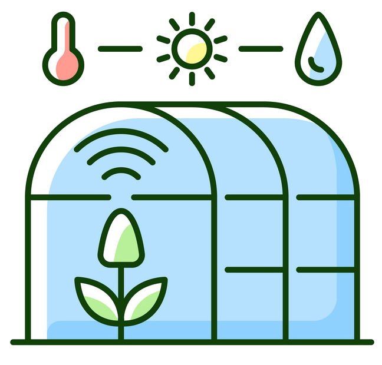

# **SmartGreenhouse**: Serverless Computing For IoT Project



## Summary

[- Introduction](#Introduction): brief introduction to the problem\
[- Architecture](#Architecture): architecture of the idea\
[- Project structure](#Project-structure): how the project is organized\
[- Getting started](#Getting-started): guide to run the project

## Introduction

This is a project for the exam of Serverless Computing for IoT.

The aim of the project is to simulate the sensors and devices used in a small home automation greenhouse with sensors for measuring the humidity temperature and equivalent tools for changing the environment inside the greenhouse.

## Architecture


As previously mentioned, all tools such as sensors and devices are falsified through special scripts.
Each sensor uses its own topic to send data with a QoS set to 0. Each sensor is assigned a relative function to process the data. Only the DHT11 sensor triggers two functions because there are two devices that need to be managed by the data.

Each function manages a devices by communicating with it with the mqtt protocol using messages with QoS 2, as activation or deactivation of a device is not a frequent operation and it is important that the device receives only one activation / deactivation message .

Each function, device and sensor sends information to a logger and a monitor working on a queue (ampq).

## Project structure

- Fakers/

  - _**StartFakers.js**_: tscript that aggregates all the falsifiers (sensors and devices) and starts them all
  - _**Devices/**_: folder containing devices falsifiers
  - _**Sensonrs/**_: folder containing sensor falsifiers
- Functions/
  - _**coolinghandler.js**_: takes care of processing received values from DHT11 sensor and to turn on/off fan.
  - _**heaterhandler.js**_: takes care of processing received values from DHT11 sensor and to turn on/off heater.
  - _**lightshandler.js**_: takes care of processing received values from photorestor sensor and to turn on/off lights.
  - _**sprinklerhandler.js**_: takes care of processing received values from hygrometer sensor and to turn on/off sprikler.
  - _**waterlevelhandler.js**_: takes care of processing received values from water level sensor.
- **.env**: file containing settings for javascript scripts
- _**logger.js**_: takes care of printing all data from devices, sensors and functions.
- _**monitor.js**_: takes care to print the current state af all devices, sensors and functions.


## Getting started

### Docker
Install [Docker](https://www.docker.com) using the Docker CE installation [guide](https://docs.docker.com/install/linux/docker-ce/ubuntu/#extra-steps-for-aufs).

```sh
$ sudo apt-get update
$ sudo apt-get install \
    apt-transport-https \
    ca-certificates \
    curl \
    gnupg \
    lsb-release
$ curl -fsSL https://download.docker.com/linux/ubuntu/gpg | sudo gpg --dearmor -o /usr/share/keyrings/docker-archive-keyring.gpg
$ echo \
  "deb [arch=amd64 signed-by=/usr/share/keyrings/docker-archive-keyring.gpg] https://download.docker.com/linux/ubuntu \
  $(lsb_release -cs) stable" | sudo tee /etc/apt/sources.list.d/docker.list > /dev/null
$ sudo apt-get update
$ sudo apt-get install docker-ce
```

------------------------------------------------------------------------------------------------------------------------------

### Docker Compose

Install Docker Compose using the Docker Compose installation [guide](https://docs.docker.com/compose/install/#install-compose).

```sh
$ sudo curl -L "https://github.com/docker/compose/releases/download/1.22.0/docker-compose-$(uname -s)-$(uname -m)" -o /usr/local/bin/docker-compose
$ sudo chmod +x /usr/local/bin/docker-compose
```

----------------------------------------------------------------------------------------------------------------------------


### Nuclio 
Start [Nuclio](https://github.com/nuclio/nuclio) using a docker container.

```sh
$ docker run -p 8070:8070 -v /var/run/docker.sock:/var/run/docker.sock -v /tmp:/tmp nuclio/dashboard:stable-amd64
```

Browse to http://localhost:8070.

----------------------------------------------------------------------------------------------------------------------------

### RabbitMQ 

Start [RabbitMQ](https://www.rabbitmq.com) instance with MQTT enabled using docker.

```sh
$ docker run -p 9000:15672  -p 1883:1883 -p 5672:5672  cyrilix/rabbitmq-mqtt 
```

Browse to http://localhost:9000. The default username is ***guest***, and the password is ***guest***

------------------------------------------------------------------------------------------------------------------------------
### Node.JS
If you haven't Node.JS, you heve to install it. <br>
Install [Node.JS](https://nodejs.org/it/).

```sh
sudo apt install nodejs
```
### Parameters
In each files replace this strings with you valid parameter
* ***MQTT-BROKER-IP*** the ip of the MQTT broker
* ***MQTT-USERNAME*** the username for MQTT
* ***MQTT-PASSWORD*** the password for MQTT
* ***AMQP_BROKER_IP*** the ip of the AMQP broker

***⚠️:*** files you have to modity are `.env` file and all `.yaml` files

------------------------------------------------------------------------------------------------------------------------------

- **Update and deploy Functions**:
- Type '**localhost:8070**' on your browser to open the homepage of Nuclio
- Create new project
- Press '**Create function**', '**Import**' and upload the two functions that are in the **yaml_functions** folder
- In both, **change the already present [parameters](#parameters) with yours**\
**⚠️Do not forget the trigger⚠️**
- Press **'Deploy'**.


------------------------------------------------------------------------------------------------------------------------------

**Do not forget run command below to install all dependencies**
```sh
npm install
```
### Logger
Start logger
```sh
node logger.js
```

### Monitor
Start monitor
```sh
node monitor.js
```
### Fakers
Start all fakers
```sh
cd Fakers
node StartFakers.js
```
